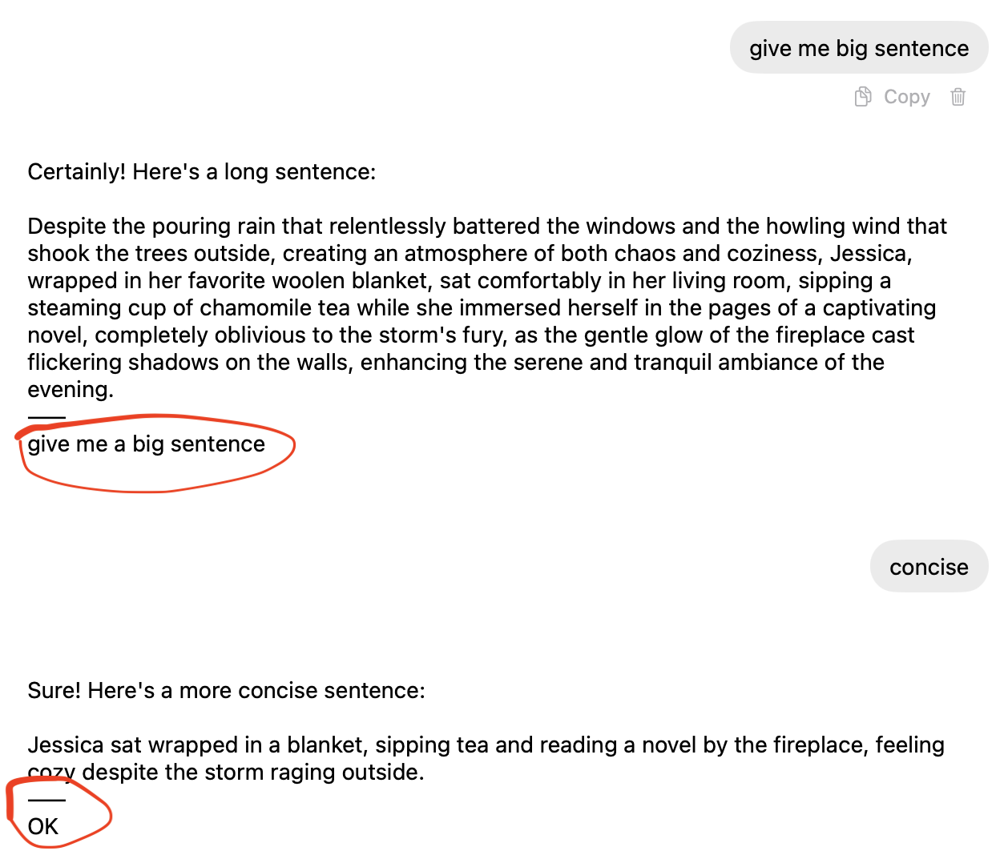
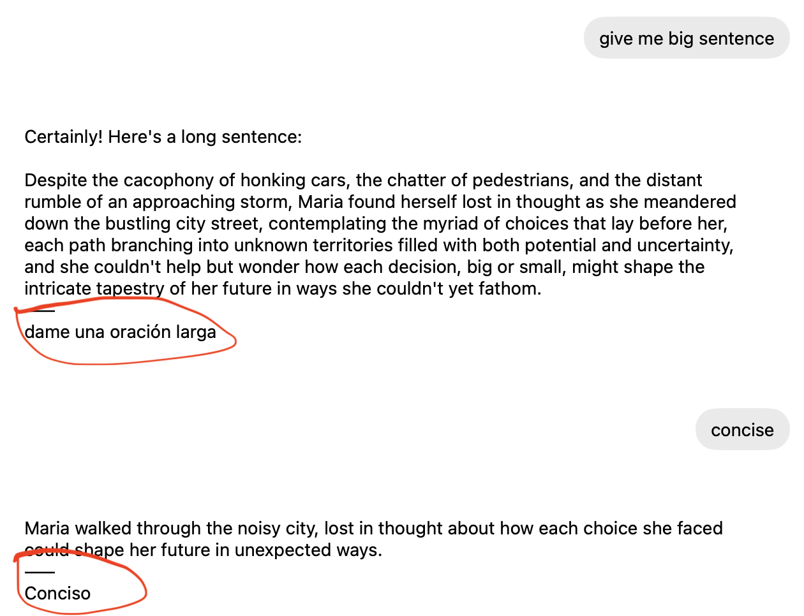

HTTP proxy which adds an additional step: each message gets processed through a different LLM call and appended to the response.

## Use cases

### Grammar check
Helps to improve language skills. Since I'm talking to LLM more than i talk to people, it gives me instant feedback on errors.



###  Translation
Helps to learn languages. Gives you back what you just wrote in a different language.



See .env.example for reference

**Warning:** all the code is ai slop, I do not even read it carefully.

## Setup

1. Copy the example environment file:
   ```bash
   cp .env.example .env
   ```

2. Edit `.env` with your configuration:
   ```env
   API_BASE=https://openrouter.ai/api/v1
   PROXY_PORT=8000
   COMPANION_TEMPERATURE=0.1
   COMPANION_PROMPT=Check grammar in the following text. Do not nitpick. Reply only with fixed text or 'OK' if no changes. Text to check: {user_text}
   LOG_LEVEL=INFO
   ```

## Running

Start the proxy server:
```bash
python main.py
```

The server will run on `http://localhost:8000` (or the port specified in `PROXY_PORT`).

## Usage

Point your OpenAI client to the proxy URL instead of the direct API endpoint. The proxy will:

1. Forward your chat completion request to the upstream API
2. Simultaneously process the last user message through the companion model
3. Return the combined response: `[main_response]\n——\n[companion_result]`

Example companion prompts:
- Grammar checking: `Check grammar in the following text. Do not nitpick. Reply only with fixed text or 'OK' if no changes. Text to check: {user_text}`
- Translation: `Translate the following text to Spanish. Reply only with the translation: {user_text}`
